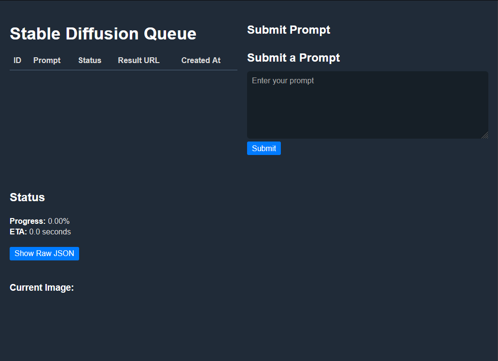

## SQ Queue
A small application i built for myself, with the purpose of submitting tons of image generation requests to stable diffusion webui, without having to wait in the UI.
It features a flow-y UI that scales to any screen size (except early iphones probably).
Its really simple at this point and doesnt have alot of features.

Uses golang as the backend, sqlite as the database, reactjs frontend.

TODOs:
* Better queue display (option to display old requests, fill url, delete)
* Remember old prompts
* Prettier frontend
* Migrations
* Config upload via UI
* Healthcheck

